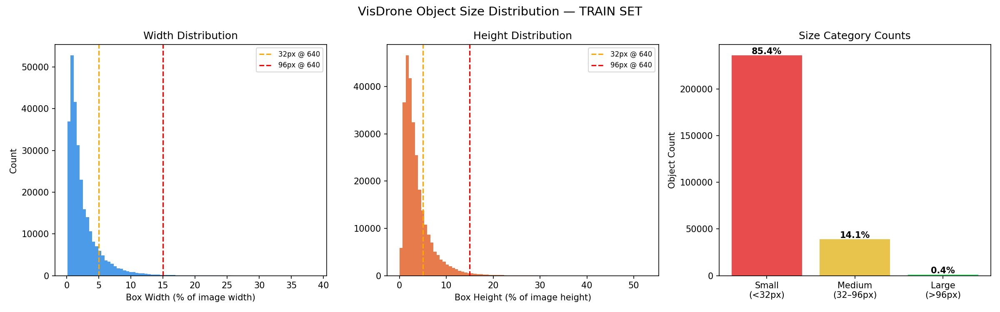

# Dataset Understanding and Preprocessing

## Why this document name

This README is named `dataset_understanding_and_preprocessing` to match the scope of work in this phase:

- dataset understanding: quantify class distribution and imbalance
- preprocessing: remap labels into the task-specific classes

Using this explicit name keeps the focus on the dataset analysis and the transformations applied before training.

## What was done

1. Ran dataset diagnostics to measure class distribution and imbalance.
2. Defined a 2-class mapping for the task (person, car).
3. Remapped VisDrone labels into a new dataset root.
4. Validated the remapped dataset with the same diagnostics.

## Commands used

```bash
# Diagnose original VisDrone labels (10 classes)
python -m src.data.diagnose

# Remap to 2 classes (person, car)
python -m src.data.remap_classes

# Diagnose remapped labels (2 classes)
python -m src.data.diagnose
```

## Class mapping

- person: class 0 (pedestrian) + class 1 (people/crowd)
- car: class 3 (car) + class 4 (van)
- dropped: 2, 5, 6, 7, 8, 9

## Results

### Original VisDrone (10 classes)

- train: 10 classes | imbalance 44.6x | 343,205 objects
- val: 10 classes | imbalance 56.0x | 38,759 objects
- test: 10 classes | imbalance 53.0x | 75,102 objects

### Remapped (2 classes)

- train: 2 classes | imbalance 1.6x | 276,219 objects
- val: 2 classes | imbalance 1.1x | 30,008 objects
- test: 2 classes | imbalance 1.2x | 61,227 objects

## Key outcome

After remapping to person/car, the severe class imbalance drops from ~45-56x to ~1.1-1.6x, which is a healthier distribution for training.

## Size distribution



## Configuration files

- Remapped dataset YAML: config/visdrone_2class.yaml
- Remap script: src/data/remap_classes.py

## Notes

- The diagnostics script reads the YAML pointed to by `APP_DATASET_YAML` in `.env`.
- The remap script writes a new dataset root at `dataset/dataset_drone/VisDrone_2class` by default.
